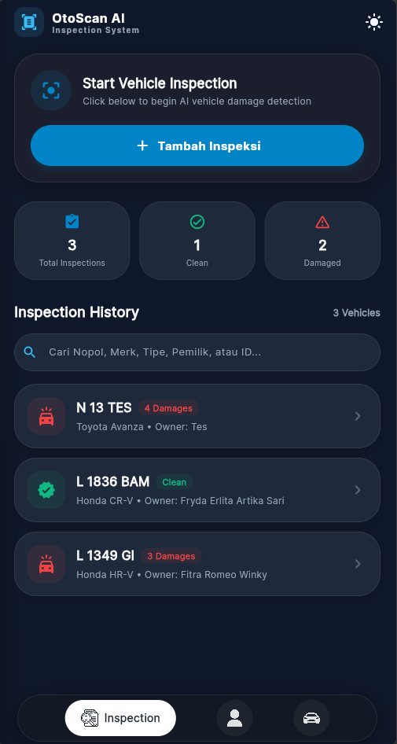
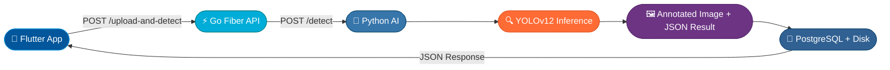

<div align="center">


# 🚗 OtoScan AI — Intelligent Vehicle Inspection System

**OtoScan AI** adalah sistem inspeksi fisik kendaraan berbasis kecerdasan buatan yang mendeteksi kerusakan otomatis menggunakan **YOLOv12 Computer Vision**. Sistem dirancang sebagai **Monorepo** dengan 3 microservice yang terintegrasi secara penuh.

[🔗 Live Demo](#) · [🐛 Report Bug](https://github.com/fitraaromeo/Otoscan-AI/issues) · [💡 Request Feature](https://github.com/fitraaromeo/Otoscan-AI/issues)

</div>

---

## 📸 Screenshots

<div align="center">

| Dashboard | 4-Side Scanner | Inspection Detail |
| :---: | :---: | :---: |
|  |  |  |
| Daftar kendaraan & statistik inspeksi | Scanner 4 sisi kendaraan + AI detection | Laporan kerusakan & annotated bounding box |

</div>


---

## 🏗️ Arsitektur Sistem

```
Otoscan-AI (Monorepo)
│
├── 📱  otoscan_app/       — Flutter Frontend (Web · Android · iOS)
│       └── Provider · REST API · Real-time AI Scan Canvas
│
├── ⚡  otoscan-api/       — Go Fiber REST API + PostgreSQL
│       └── GORM · JWT Auth · Static File Server · CORS
│
└── 🧠  ai-service/        — Python FastAPI AI Microservice
        └── YOLOv12 · OpenCV · Bounding Box Annotation
```

### 🔄 Alur Data



---

## 🧠 AI — Damage Detection

Model **YOLOv12** dilatih dengan dataset **CarDD (Car Damage Detection)** untuk mendeteksi 6 jenis kerusakan:

| Kode            | Jenis Kerusakan  | Ikon |
| --------------- | ---------------- | ---- |
| `dent`          | Penyok / Lekukan | 🔵   |
| `scratch`       | Goresan / Lecet  | 🟡   |
| `crack`         | Retak / Pecah    | 🔴   |
| `glass_shatter` | Kaca Pecah       | 🟣   |
| `lamp_broken`   | Lampu Rusak      | 🟠   |
| `tire_flat`     | Ban Kempes       | ⚪   |

---

## 🛠️ Tech Stack

### 📱 Frontend — `otoscan_app/`

- **Framework**: Flutter 3.x (Multi-Platform)
- **State Management**: Provider
- **Features**:
  - Inspeksi visual 4-sisi kendaraan (Depan · Belakang · Samping · Atas)
  - Tampilan annotated bounding box hasil AI dari backend
  - Light / Dark Mode dinamis
  - Manajemen data kendaraan, karyawan, dan history inspeksi

### ⚡ Backend API — `otoscan-api/`

- **Language**: Go (Golang) v1.21+
- **Framework**: Fiber v2
- **Database**: PostgreSQL + GORM ORM
- **Features**:
  - Auto Migration & Database Seeding
  - Static file server dengan CORS (`/uploads/inspections/`, `/uploads/results/`)
  - REST Endpoints: Kendaraan, Karyawan, Inspeksi, AI Detection
  - Cascading delete inspeksi

### 🧠 AI Microservice — `ai-service/`

- **Language**: Python 3.10+
- **Framework**: FastAPI + Uvicorn
- **Model**: YOLOv12 (CarDD Dataset)
- **Libraries**: Ultralytics, OpenCV, Pillow
- **Output**: Annotated JPEG + JSON koordinat bounding box

---

## 🚀 Quick Start

### Prerequisites

| Tool        | Minimum Version |
| ----------- | --------------- |
| Flutter SDK | 3.x             |
| Go          | 1.21+           |
| Python      | 3.10+           |
| PostgreSQL  | 14+             |

### 📥 Clone Repository

```bash
git clone https://github.com/fitraaromeo/Otoscan-AI.git
cd Otoscan-AI
```

---

### Step 1 — 🧠 Jalankan AI Microservice (Port: 8000)

```bash
cd ai-service
pip install -r requirements.txt
python main.py
```

> ✅ AI berjalan di `http://127.0.0.1:8000`

---

### Step 2 — ⚡ Jalankan Go Fiber API Backend (Port: 8080)

Buat file `.env` di dalam folder `otoscan-api/`:

```env
DB_HOST=localhost
DB_PORT=5432
DB_USER=postgres
DB_PASSWORD=yourpassword
DB_NAME=otoscan_db
AI_SERVICE_URL=http://localhost:8000
```

Kemudian jalankan:

```bash
cd otoscan-api
go run main.go
```

> ✅ API berjalan di `http://localhost:8080`  
> ✅ Static uploads tersedia di `http://localhost:8080/uploads/`

---

### Step 3 — 📱 Jalankan Flutter App

```bash
cd otoscan_app
flutter pub get
flutter run -d chrome
```

> ✅ App Flutter terbuka di browser / perangkat

---

## 📂 Struktur Project

```
Otoscan-AI/
│
├── 📱 otoscan_app/
│   ├── lib/
│   │   ├── models/         # Data Models (VehicleRecord, AngleCapture, DamageItem)
│   │   ├── screens/        # UI Screens (Dashboard, Scanner, Detail, Login)
│   │   ├── services/       # API Service (HTTP Client)
│   │   ├── state/          # App State (Provider)
│   │   ├── theme/          # App Theme & Colors
│   │   └── widgets/        # Reusable Widgets
│   └── pubspec.yaml
│
├── ⚡ otoscan-api/
│   ├── config/             # Database Config
│   ├── handlers/           # HTTP Handlers (inspection, ai, employee, vehicle)
│   ├── middleware/         # Auth Middleware
│   ├── models/             # GORM Models
│   ├── routes/             # API Routes
│   ├── uploads/            # Uploaded & Result Images
│   │   ├── inspections/    # Raw uploaded photos
│   │   └── results/        # AI-annotated result images
│   └── main.go
│
├── 🧠 ai-service/
│   ├── main.py             # FastAPI entry point
│   ├── requirements.txt
│   └── yolov12/            # YOLOv12 model & utilities
│
├── 🐳 docker-compose.yml   # Docker orchestration (optional)
└── 📄 README.md
```

---

## 📡 API Endpoints

| Method   | Endpoint                                 | Deskripsi                         |
| -------- | ---------------------------------------- | --------------------------------- |
| `POST`   | `/api/auth/login`                        | Login pengguna                    |
| `GET`    | `/api/vehicles`                          | Daftar semua kendaraan            |
| `GET`    | `/api/employees`                         | Daftar semua karyawan             |
| `GET`    | `/api/inspections`                       | Daftar semua inspeksi             |
| `POST`   | `/api/inspections`                       | Buat inspeksi baru                |
| `POST`   | `/api/inspections/:id/upload-and-detect` | Upload foto + jalankan AI YOLOv12 |
| `DELETE` | `/api/inspections/:id`                   | Hapus data inspeksi               |

---

## 🐳 Docker (Opsional)

```bash
docker-compose up -d
```

---

## 👤 Author

**Fitra Romeo Winky**

[](https://github.com/fitraaromeo)
[](https://www.instagram.com/fitraaromeo)
[](https://www.linkedin.com/in/fitra-winky-380836266/)
[](https://portfolio-fitra-romeo-winky.vercel.app/)

---

## 📄 License

Distributed under the **MIT License**. See `LICENSE` for more information.

---

<div align="center">
  Made with ❤️ using Flutter · Go Fiber · Python FastAPI · YOLOv12
</div>
